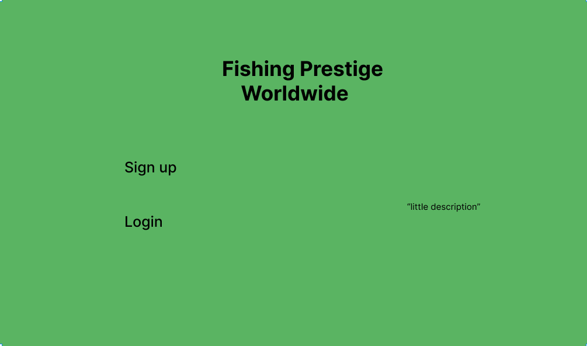
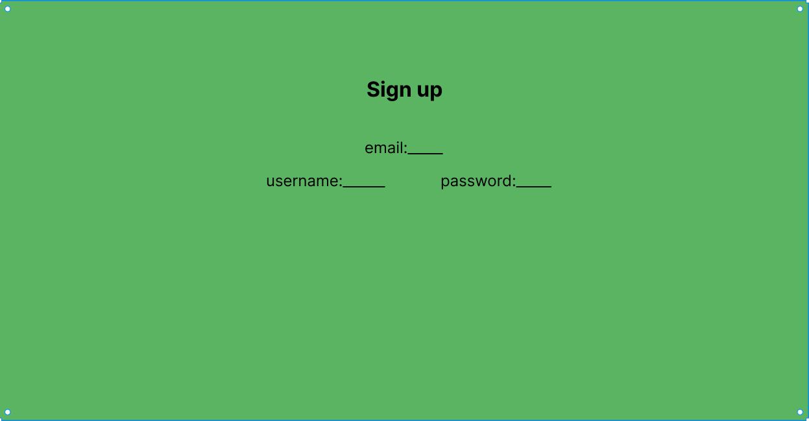
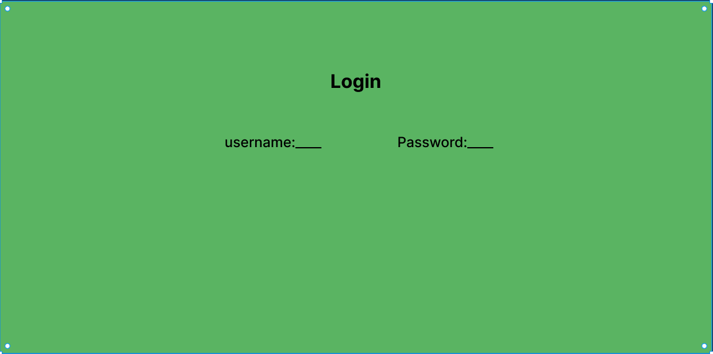
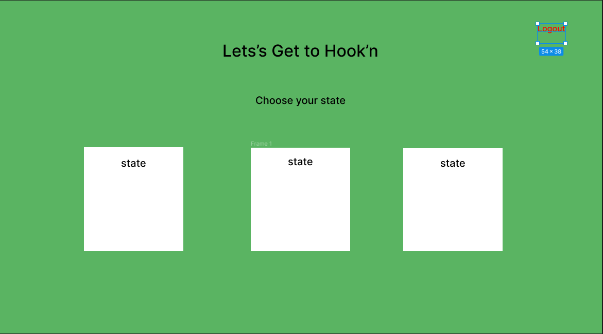
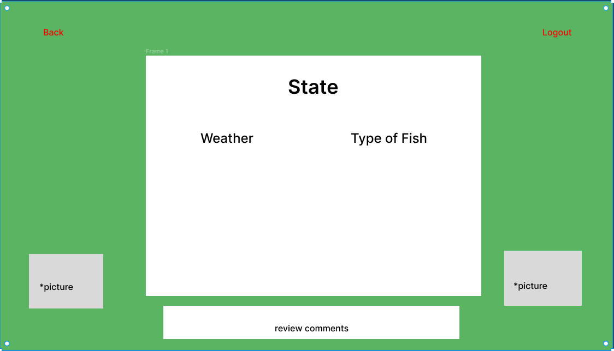
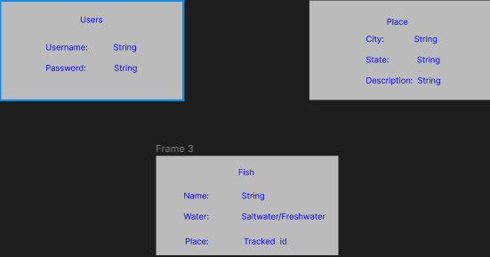

# Project-FishingApp
The application that I will be creating is a fishing app.

 # Overview
 My app will consist of the best kinds of fish to go out and catch in the one and only Tampa-Bay, FLorida. It will also give the user the capability to check the weather the day of which they want to go out and cast!

 As the creator, I will build a platform that makes it very easy and simple for anyone to not just browse through the app but get wonderful information about the fish itself.

 # User-Stories
 As a user, I want the ability to ...
 - Create an account
 - Login
 - logout
 - browse without having to create a login
 - Be able to leave a comment/review (have to have an account)
 - once in a specific state, be able to hit a back button and go back to the previous page
 - You will be able to check the weather of the location you are browsing

 # Technology Used
 - Mongodb
 - Express
 - Liquid.js
 - Nodemon
 - CSS

 # Stretch Goals
 - Being able to create a very functional app with all supported states with fishing as well an up to date weather api.
 - Consiseering with time management, to try and implement a moving background.

 # Where My Information is coming from
 - Weather API
 - will create a 10-15 seeds
 example: https://goweather.herokuapp.com/weather/(city/State)

 #  Schedule for the week
 - I will creating 10-15 seed which i will be doing 3-4 of them everyday and start connecting everyhting together

# Wireframes

# Entity Relationship Diagrams (ERD)

